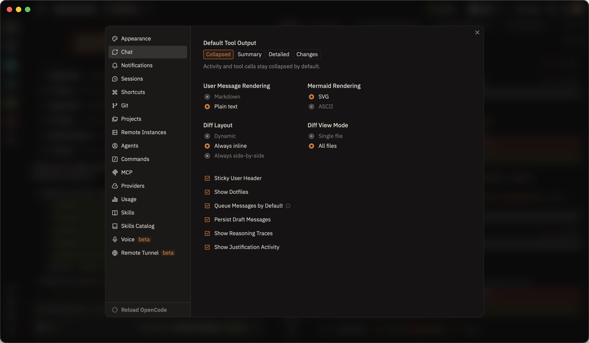

# <picture><source media="(prefers-color-scheme: dark)" srcset="docs/references/badges/openchamber-logo-dark.svg"></picture> OpenChamber

[![GitHub stars](https://img.shields.io/github/stars/btriapitsyn/openchamber?style=flat&logo=data%3Aimage%2Fsvg%2Bxml%3Bbase64%2CPHN2ZyB4bWxucz0iaHR0cDovL3d3dy53My5vcmcvMjAwMC9zdmciIHdpZHRoPSIzMiIgaGVpZ2h0PSIzMiIgZmlsbD0iI2YxZWNlYyIgdmlld0JveD0iMCAwIDI1NiAyNTYiPjxwYXRoIGQ9Ik0yMjkuMDYsMTA4Ljc5bC00OC43LDQyLDE0Ljg4LDYyLjc5YTguNCw4LjQsMCwwLDEtMTIuNTIsOS4xN0wxMjgsMTg5LjA5LDczLjI4LDIyMi43NGE4LjQsOC40LDAsMCwxLTEyLjUyLTkuMTdsMTQuODgtNjIuNzktNDguNy00MkE4LjQ2LDguNDYsMCwwLDEsMzEuNzMsOTRMOTUuNjQsODguOGwyNC42Mi01OS42YTguMzYsOC4zNiwwLDAsMSwxNS40OCwwbDI0LjYyLDU5LjZMMjI0LjI3LDk0QTguNDYsOC40NiwwLDAsMSwyMjkuMDYsMTA4Ljc5WiIgb3BhY2l0eT0iMC4yIj48L3BhdGg%2BPHBhdGggZD0iTTIzOS4xOCw5Ny4yNkExNi4zOCwxNi4zOCwwLDAsMCwyMjQuOTIsODZsLTU5LTQuNzZMMTQzLjE0LDI2LjE1YTE2LjM2LDE2LjM2LDAsMCwwLTMwLjI3LDBMOTAuMTEsODEuMjMsMzEuMDgsODZhMTYuNDYsMTYuNDYsMCwwLDAtOS4zNywyOC44Nmw0NSwzOC44M0w1MywyMTEuNzVhMTYuMzgsMTYuMzgsMCwwLDAsMjQuNSwxNy44MkwxMjgsMTk4LjQ5bDUwLjUzLDMxLjA4QTE2LjQsMTYuNCwwLDAsMCwyMDMsMjExLjc1bC0xMy43Ni01OC4wNyw0NS0zOC44M0ExNi40MywxNi40MywwLDAsMCwyMzkuMTgsOTcuMjZabS0xNS4zNCw1LjQ3LTQ4LjcsNDJhOCw4LDAsMCwwLTIuNTYsNy45MWwxNC44OCw2Mi44YS4zNy4zNywwLDAsMS0uMTcuNDhjLS4xOC4xNC0uMjMuMTEtLjM4LDBsLTU0LjcyLTMzLjY1YTgsOCwwLDAsMC04LjM4LDBMNjkuMDksMjE1Ljk0Yy0uMTUuMDktLjE5LjEyLS4zOCwwYS4zNy4zNywwLDAsMS0uMTctLjQ4bDE0Ljg4LTYyLjhhOCw4LDAsMCwwLTIuNTYtNy45MWwtNDguNy00MmMtLjEyLS4xLS4yMy0uMTktLjEzLS41cy4xOC0uMjcuMzMtLjI5bDYzLjkyLTUuMTZBOCw4LDAsMCwwLDEwMyw5MS44NmwyNC42Mi01OS42MWMuMDgtLjE3LjExLS4yNS4zNS0uMjVzLjI3LjA4LjM1LjI1TDE1Myw5MS44NmE4LDgsMCwwLDAsNi43NSw0LjkybDYzLjkyLDUuMTZjLjE1LDAsLjI0LDAsLjMzLjI5UzIyNCwxMDIuNjMsMjIzLjg0LDEwMi43M1oiPjwvcGF0aD48L3N2Zz4%3D&logoColor=FFFCF0&labelColor=100F0F&color=66800B)](https://github.com/btriapitsyn/openchamber/stargazers)
[](https://github.com/btriapitsyn/openchamber/releases/latest)
[](https://opencode.ai)
[](https://discord.gg/ZYRSdnwwKA)
[](https://ko-fi.com/G2G41SAWNS)

**OpenCode, everywhere.** Desktop. Browser. Phone.

A GUI for [OpenCode](https://opencode.ai) that works alongside the TUI — start a session in your terminal, pick it up on your phone, finish it on your laptop. Same conversation, any screen.


<details>
<summary>More screenshots</summary>





<p>


</p>

</details>

## Why a GUI?

OpenCode's TUI is excellent. OpenChamber is for those moments when you want a visual workspace — reviewing diffs side-by-side, keeping an eye on multiple agents at once, or just continuing a session from your phone while away from the keyboard.

They share the same sessions. Use whatever feels right.

## Highlights

- **Use it from anywhere** — Cloudflare tunnel with QR code onboarding. Scan, connect, code from your couch.
- **Branchable chat timeline** — Undo, redo, fork from any turn. Explore different approaches without losing your place.
- **GitHub-native workflows** — Start sessions from issues and PRs with context already attached. Review checks, merge — all in-app.
- **Project Actions** — Run dev servers, configure SSH port forwarding, open remote URLs locally. Your project commands, one click away.
- **Connect to remote machines** — Desktop app connects to remote OpenChamber instances over SSH, with dedicated lifecycle and UX flows.

## Quick Start

> **Prerequisite:** [OpenCode CLI](https://opencode.ai) installed.

**Desktop (macOS)** — Download from [Releases](https://github.com/btriapitsyn/openchamber/releases).

**VS Code** — Install from [Marketplace](https://marketplace.visualstudio.com/items?itemName=fedaykindev.openchamber) or search "OpenChamber" in Extensions.

**CLI (Web + PWA)** — requires Node.js 20+

```bash
curl -fsSL https://raw.githubusercontent.com/btriapitsyn/openchamber/main/scripts/install.sh | bash
openchamber --ui-password be-creative-here --daemon
```

<details>
<summary>Advanced CLI options</summary>

```bash
openchamber --port 8080              # Custom port
openchamber --daemon                 # Background mode
openchamber --ui-password secret     # Password-protect UI
openchamber --try-cf-tunnel          # Cloudflare Quick Tunnel
openchamber --try-cf-tunnel --tunnel-qr              # + QR code
openchamber --try-cf-tunnel --tunnel-password-url     # + password in URL
openchamber stop                     # Stop server
openchamber update                   # Update to latest
```

Connect to an existing OpenCode server:
```bash
OPENCODE_PORT=4096 OPENCODE_SKIP_START=true openchamber
OPENCODE_HOST=https://myhost:4096 OPENCODE_SKIP_START=true openchamber
```

</details>

<details>
<summary>Docker</summary>

```bash
docker compose up -d
```

Available at `http://localhost:3000`.

**UI Password:**
```yaml
environment:
  UI_PASSWORD: your_secure_password
```

**Cloudflare Tunnel:**
```yaml
environment:
  CF_TUNNEL: "true" # Options: true, qr, password
```

| Value      | Description                     |
| ---------- | ------------------------------- |
| `true`     | Enable tunnel only              |
| `qr`       | Enable tunnel + QR code         |
| `password` | Enable tunnel + password in URL |

**Data directory permissions:** The `data/` directory is mounted for persistent storage. Before running:

```bash
mkdir -p data/openchamber data/opencode/share data/opencode/config data/ssh
chown -R 1000:1000 data/
```

**SSH/Git:** If git push/pull fails, run `ssh -T git@github.com` in terminal.

</details>

<details>
<summary>Named Cloudflare Tunnel (persistent hostname)</summary>

For reliable long-lived access with a custom hostname from your Cloudflare account:

- Configure in-app at **Settings > OpenChamber > Tunnel**, switch to **Named** mode.
- Requires a domain in your Cloudflare account.
- [Cloudflare setup guide](https://developers.cloudflare.com/cloudflare-one/networks/connectors/cloudflare-tunnel/get-started/create-remote-tunnel/)
- CLI `--tunnel <config.yml>` support is coming very soon.

</details>

## Features

<details>
<summary><strong>Chat & Interaction</strong></summary>

- Branchable chat timeline with `/undo`, `/redo`, and one-click forks from any turn
- Multi-agent runs from one prompt with isolated worktrees for safe side-by-side comparisons
- Voice mode with speech input and read-aloud responses for hands-free workflows
- Plan/Build mode with a dedicated plan view for drafting and iterating steps
- Inline comment drafts on diffs, files, and plans — send feedback back to the agent
- Shell mode via leading `!` with inline output
- Share messages as images
- Mermaid diagrams render inline with copy/download actions
- Smart tool UIs for diffs, file operations, permissions, and task progress

</details>

<details>
<summary><strong>Git & GitHub</strong></summary>

- Full Git sidebar with staging, commits, push/pull, branch management, and rebase/merge flows
- PR creation with AI-generated descriptions, status checks, and merge actions
- Start sessions from GitHub issues and pull requests with context baked in
- Multi-remote push and fork-aware PR creation
- Worktree integration: isolated sessions per branch, merge back with conflict handling
- Git identities, gitmoji support, and multi-account GitHub auth

</details>

<details>
<summary><strong>Files, Diff & Terminal</strong></summary>

- Workspace file browser with inline editing, syntax highlighting, and markdown preview
- Beautiful diff viewer with stacked/inline modes, lazy loading for large changesets
- Integrated terminal with per-directory sessions, tabbed interface, and stable heavy-output performance
- Clickable file paths in messages — jump to exact line locations
- File-type icons across all views for faster visual scanning

</details>

<details>
<summary><strong>Web / PWA</strong></summary>

- Cloudflare tunnel with Quick and Named modes, secure one-time connect links, and QR onboarding
- Mobile-first: optimized chat controls, keyboard-safe layouts, drag-to-reorder projects
- Background notifications and cross-tab session tracking
- Self-update + restart flow that keeps your server settings intact
- Installable as PWA with project-aware naming

</details>

<details>
<summary><strong>Desktop (macOS)</strong></summary>

- Connect to remote OpenChamber instances over SSH with dedicated lifecycle flows
- Project Actions: run dev servers, SSH port forwarding, open remote URLs locally
- Multi-window support for parallel project workflows
- "Open In" shortcuts for Finder, Terminal, and your preferred editor
- Fast switching between local and remote instances
- Native macOS menu, deep-link handling, and polished startup

</details>

<details>
<summary><strong>VS Code Extension</strong></summary>

- Editor-native: open files from tool output, keep sessions beside your code
- Agent Manager for parallel multi-model runs from a single prompt
- Right-click actions: add context, explain selections, improve code in-place
- Session editor panel, responsive layout, and theme mapping to your editor
- Edit-style tool results open directly in focused diff views

</details>

<details>
<summary><strong>Customization</strong></summary>

- 18+ built-in themes with light/dark variants
- Custom themes via JSON files in `~/.config/openchamber/themes/` — hot reload, no restart
- Configurable keyboard shortcuts for chat, panels, and services
- Font size, spacing, corner radius, and layout controls
- Customizable project icons with upload and automatic favicon discovery
- Skills catalog and local skill management for reusable automation

[Read the Guide: Custom Themes](docs/CUSTOM_THEMES.md)

</details>

<details>
<summary><strong>Context & Productivity</strong></summary>

- Token usage, cost breakdowns, and raw message inspection panel
- Usage quota tracking across multiple providers with pace/prediction indicators
- Favorite model cycling via keyboard shortcuts
- Session folders and subfolders with drag-to-reorder
- Persistent project notes and todos per project
- Draft persistence per session with expanded focus mode for longer prompts

</details>

## Roadmap

Active development. Here's what's being worked on or planned:

- Windows and Linux desktop apps
- Mobile app with remote instance and laptop connectivity
- More built-in tunneling options
- Kanban board for multi-agent management — keeping the human in the loop and in control
- Custom OpenCode plugins/tools built-in catalog
- Linear integration
- Built-in browser for running dev apps with agent integration

## Acknowledgments

Independent project, not affiliated with the OpenCode team.

**Special thanks to:**

- [OpenCode](https://opencode.ai) — For the excellent API and extensible architecture.
- [Flexoki](https://github.com/kepano/flexoki) — Beautiful color scheme by [Steph Ango](https://stephango.com/flexoki).
- [Pierre](https://pierrejs-docs.vercel.app/) — Fast, beautiful diff viewer with syntax highlighting.
- [Tauri](https://github.com/tauri-apps/tauri) — Desktop application framework.
- [Ghostty-web](https://github.com/coder/ghostty-web) — Great implementation of a Ghostty web renderer.
- [David Hill](https://x.com/iamdavidhill) — Who inspired me to release this without [overthinking](https://x.com/iamdavidhill/status/1993648326450020746).
- [My wife](https://github.com/yulia-ivashko), who — with zero AI background — sat down with the app for the first time and built the firework celebration that plays on every successful push.
- Every contributor who shaped this project with their PRs, ideas, and attention to detail.

## Contributing

See [CONTRIBUTING.md](./CONTRIBUTING.md) for development setup and guidelines.

## License

MIT
